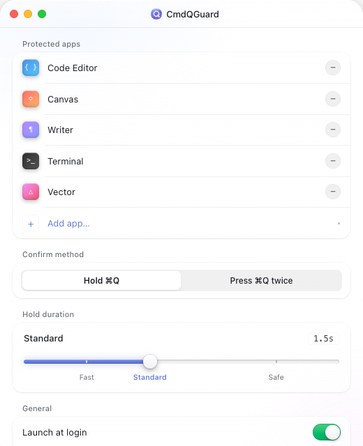
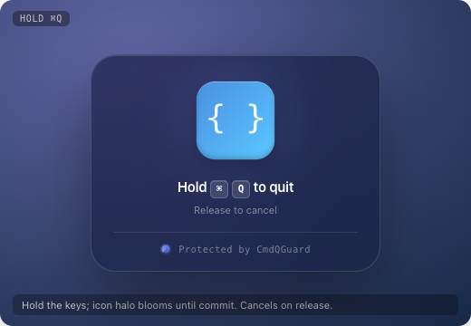
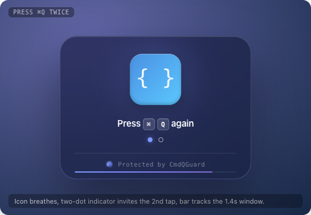

# QuitCue

<p align="center">
  
</p>

<h3 align="center">Stop one accidental Command-Q from breaking your flow.</h3>

<p align="center">
  QuitCue is a native macOS utility that protects the apps you really do not want to quit by mistake. Choose the apps that matter, pick a confirmation style, and let QuitCue stay quietly in the background until <kbd>Command-Q</kbd> actually happens.
</p>

<p align="center">
  
  
  
</p>

<p align="center">
  <a href="https://quitcue.app">quitcue.app</a>
</p>

## Demo Video

See the core flow in 8 seconds: after you choose a protected app, QuitCue shows a confirmation overlay when that app receives <kbd>Command-Q</kbd>, and the app stays open until you confirm.

<p align="center">
  <video src="docs/assets/quitcue-demo.mp4" poster="docs/assets/quitcue-demo-poster.png" controls width="100%" title="QuitCue demo video"></video>
</p>

<p align="center">
  <a href="docs/assets/quitcue-demo.mp4">Open the demo video directly if playback is unavailable</a>
</p>

## Why QuitCue

Every serious Mac user knows the moment: an IDE is running a task, a design file is not saved, a terminal command is still going, and your fingers hit <kbd>Command-Q</kbd> out of habit. Quitting is not the real problem. Accidental quitting is too fast, too easy, and too costly.

QuitCue adds one lightweight confirmation step only for high-value apps. Unprotected apps still quit normally. Protected apps require an explicit confirmation. It does not change how macOS feels; it just makes the most expensive mispress recoverable.

QuitCue follows a small set of product principles:

- **Protect only the apps worth protecting.** IDEs, design tools, writing apps, terminals, and browsers can all be added as needed.
- **Stay quiet during normal work.** QuitCue lives in the background and only appears when a protected app receives <kbd>Command-Q</kbd>.
- **Feel like part of the system.** It is built with SwiftUI, AppKit, macOS materials, Accessibility permissions, and a system-level event tap.

## Product Experience

### Choose Key Apps

QuitCue scans the macOS apps installed on your machine and lets you manage the protected list from a compact control panel. Protected apps are shown first, so you can quickly verify what QuitCue is guarding.



### Two Confirmation Styles

Choose the style that best fits your muscle memory:

- **Hold Command-Q**: hold the shortcut until the progress ring completes, then the app quits.
- **Press Command-Q twice**: the first press shows the prompt, and the second press confirms within a short time window.

<p align="center">
  
  
</p>

### Built For Real macOS Behavior

QuitCue uses `CGEventTap` to listen for and intercept plain <kbd>Command-Q</kbd> in protected apps. It lets unprotected apps quit normally, preserves other shortcuts that use Shift, Option, Control, or other modifiers, and keeps QuitCue itself running after the target app is confirmed and quit.

## Highlights

- App-level protection list persisted by Bundle ID.
- First-run onboarding for Accessibility permissions and initial protected-app selection.
- Hold-to-confirm and double-press confirmation modes.
- Adjustable hold duration and double-press confirmation window.
- Native control panel for protected apps, confirmation method, launch at login, and core settings.
- System-level confirmation overlay that appears only when a protected app tries to quit.
- Release DMG generation with a path toward Developer ID signing and notarization.
- Unit tests, UI tests, and Tart VM isolation tests across different risk levels.

## Install

QuitCue is currently in MVP development. You can build a local release package with:

```bash
xcodegen generate
scripts/package-release-dmg.sh
```

The installer image is written to `dist/QuitCue-<version>.dmg`. To inject a version from a release tag, pass `--marketing-version` and `--build-number`.

After installation, grant QuitCue Accessibility permission in macOS so it can intercept <kbd>Command-Q</kbd>:

`System Settings` -> `Privacy & Security` -> `Accessibility` -> enable `QuitCue`.

## Development

Before development, install:

- Xcode 26 or later
- XcodeGen
- create-dmg, used for local installer packaging
- Tart, used for isolated UI and EventTap tests

Common entry point:

```bash
xcodegen generate
open QuitCue.xcodeproj
```

`project.yml` is the source of truth for the project structure. The generated Xcode project is treated as a build artifact.

## License

QuitCue is released under the [MIT License](LICENSE).
